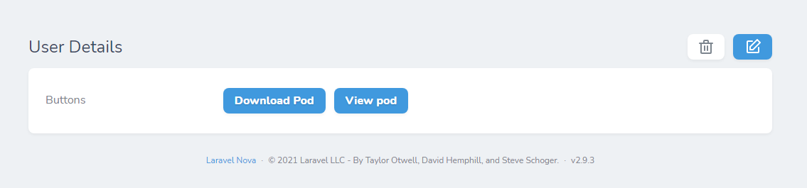

# DownloadButton

[](https://packagist.org/packages/haythem/)
[](https://packagist.org/packages/haythem/download-button)

Package Description: Download button nova field
 




## Installation

Install via composer
```bash
composer require haythem/download-button
```

## Setup route

```
Route::get('/progressbar', function () {
    $pdf = PDF::loadView('pod',[])->setWarnings(false)->output();;
    Storage::disk('public')->put("test.pdf", $pdf);
    $file_url =     Storage::disk('public')->url("test.pdf");
    logger(request()->all());
    if (Arr::has(request()->all(),"download")) {
        return $pdf;
    }
    return $file_url;
});
```

## Usage

```php
    use Haythem\DownloadButton\DownloadButton;
    
    public function fields(Request $request)
    {
     return [
            DownloadButton::make("Buttons")
            ->url("http://haythem.test/api/pod")
            ->downloadButtonText("Download Pod")
            ->showViewButtonText("View pod"),
    ];
    }
```
