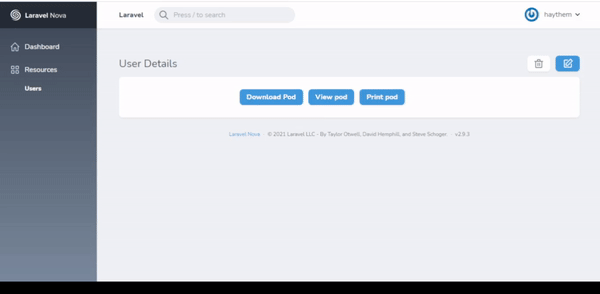

# DownloadButton

[](https://packagist.org/packages/haythem/)
[](https://packagist.org/packages/haythem/download-button)

Package Description: Download , View , Print buttons nova field
 




## Installation

Install via composer
```bash
composer require haythem/download-button
```

## Setup route

```
Route::get('/pod', function () {
    $file_name = "pod.pdf";
    $file_content = PDF::loadView('pod',[])->setWarnings(false)->output();;
    Storage::disk('public')->put($file_name, $file_content);
    $file_url =     Storage::disk('public')->url($file_name);

    return Response::make($file_content, 200, [
        'Content-Type' => 'application/pdf',//Required
        'Content-Disposition' => 'inline;',//Required
        'File-Name'=>$file_name,//Required
        "File-Url"=>$file_url,//Required
        "File-Type"=>"pdf",//Required
    ]);
});
```

## Usage

```php
    use Haythem\DownloadButton\DownloadButton;
    
    public function fields(Request $request)
    {
     return [
            DownloadButton::make("")
            ->url("http://haythem.test/api/pod")
            ->downloadButtonText("Download Pod")
            ->showViewButtonText("View pod")
            ->showPrintButtonText("Print pod"),
    ];
    }
```
